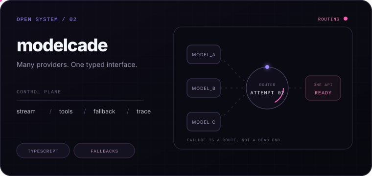
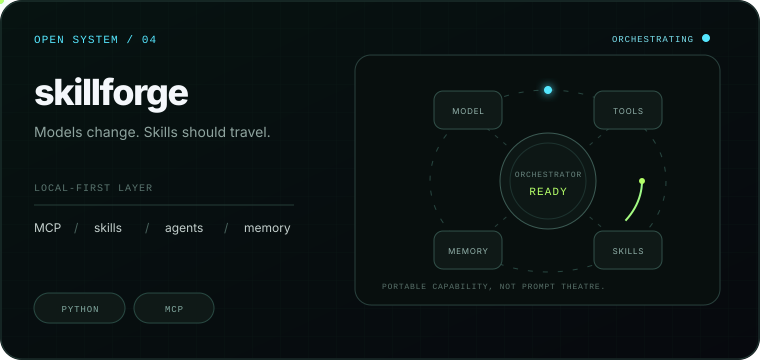

<picture>
  <source media="(prefers-reduced-motion: reduce) and (max-width: 600px)" srcset="./assets/hero-mobile-static.png">
  <source media="(prefers-reduced-motion: reduce)" srcset="./assets/hero-desktop-static.png">
  <source media="(max-width: 600px)" srcset="./assets/hero-mobile.svg">
  
</picture>

  <a href="https://jamiojala.com/en"><strong>WORK TRAIL ↗</strong></a>&nbsp;&nbsp;&nbsp;
  <a href="https://impactnode.fi/en"><strong>IMPACT NODE ↗</strong></a>&nbsp;&nbsp;&nbsp;
  <a href="https://vantnod.com/en"><strong>VANTNOD ↗</strong></a>&nbsp;&nbsp;&nbsp;
  <a href="https://www.linkedin.com/in/jamiojala"><strong>LINKEDIN ↗</strong></a>

I’m a founder-operator in Espoo, Finland. I turn messy work across finance, governance, and operations into software that people can actually trust and use.

## `01 / CURRENT TRANSMISSION`

- `BUILD` **[Vantnod](https://vantnod.com/en)**, a Finland-first company operating system. Bookkeeping is live. Studio is in a controlled pilot.
- `OPERATE` **[Impact Node](https://impactnode.fi/en)**, where I help teams decide what AI should change, then ship the systems that make it real.
- `PUBLISH` small, sharp infrastructure for structured output, model routing, evaluation, and agent workflows.

## `02 / PUBLIC SYSTEMS`

<a href="https://github.com/jamiojala/schemarail">
  <picture>
    <source media="(prefers-reduced-motion: reduce)" srcset="./assets/card-schemarail-static.png">
    
  </picture>
</a>

<a href="https://github.com/jamiojala/modelcade">
  <picture>
    <source media="(prefers-reduced-motion: reduce)" srcset="./assets/card-modelcade-static.png">
    
  </picture>
</a>

<a href="https://github.com/jamiojala/evalrail">
  <picture>
    <source media="(prefers-reduced-motion: reduce)" srcset="./assets/card-evalrail-static.png">
    
  </picture>
</a>

<a href="https://github.com/jamiojala/skillforge">
  <picture>
    <source media="(prefers-reduced-motion: reduce)" srcset="./assets/card-skillforge-static.png">
    
  </picture>
</a>

## `03 / OPERATING LOGIC`

AI handles ambiguity. Deterministic systems hold the line. Sources, uncertainty, and state stay visible. Humans keep consequential decisions. I ship one narrow loop, observe reality, then compound.

  
<strong>Why the operator part matters</strong>

   
  That logic comes from outside code too: high-volume claims operations, national youth-work systems, and elected crisis governance. Real people, real money, imperfect data, little tolerance for opaque decisions.

## `04 / OPEN CHANNEL`

**Have a difficult system to make usable?** 
[jami@impactnode.fi](mailto:jami@impactnode.fi) · [full work trail](https://jamiojala.com/en)

Built from Espoo, Finland · Finnish / English · Source over theatre
