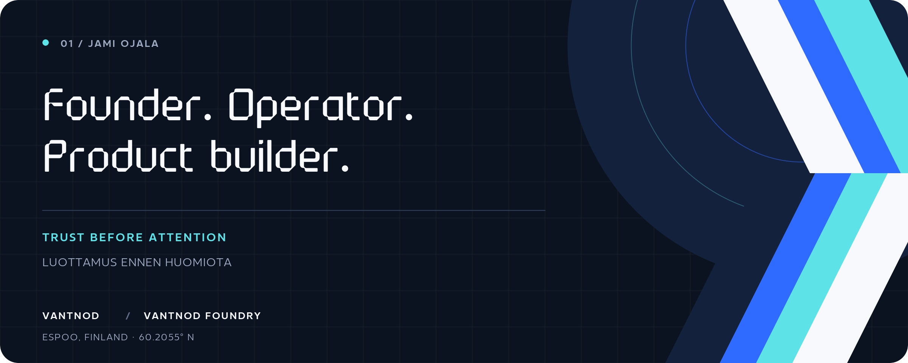

<picture>
  <source media="(max-width: 600px)" srcset="./assets/hero-doctrine-mobile.png">
  
</picture>

  <a href="https://jamiojala.com/en"><strong>WEBSITE</strong></a>
  &nbsp;·&nbsp;
  <a href="https://jamiojala.com/fi"><strong>SUOMEKSI</strong></a>
  &nbsp;·&nbsp;
  <a href="https://jamiojala.com/en/cv"><strong>CV</strong></a>
  &nbsp;·&nbsp;
  <a href="https://vantnod.com"><strong>VANTNOD</strong></a>
  &nbsp;·&nbsp;
  <a href="https://vantnodfoundry.com"><strong>FOUNDRY</strong></a>
  &nbsp;·&nbsp;
  <a href="https://www.linkedin.com/in/jamiojala"><strong>LINKEDIN</strong></a>

# Building durable products for difficult work.

## Rakennan kestäviä tuotteita vaikeaan työhön.

<table>
  <tr>
    <td width="50%" valign="top">
      <strong>EN</strong>  
      I’m Jami Ojala. I design products, operating systems and decision structures that make complex work clearer, more usable and easier to trace.
        
      My work sits where software meets the way organisations actually operate. I move between product design, engineering, programmes and governance, keeping the system understandable from the interface to the decision trail.
    </td>
    <td width="50%" valign="top" lang="fi">
      <strong>FI</strong>  
      Olen Jami Ojala. Suunnittelen tuotteita, toimintajärjestelmiä ja päätösrakenteita, jotka tekevät monimutkaisesta työstä selkeämpää, käytettävämpää ja helpommin jäljitettävää.
        
      Työni sijoittuu ohjelmistojen ja organisaatioiden todellisen toiminnan väliin. Liikun tuotesuunnittelun, kehityksen, ohjelmien ja hallinnon välillä niin, että kokonaisuus pysyy ymmärrettävänä käyttöliittymästä päätösjälkeen.
    </td>
  </tr>
</table>

## `01 / CURRENT WORK · TYÖN ALLA`

### [Vantnod](https://vantnod.com)

Vantnod is a pre-launch accounting and company-work product for founders, freelancers and small companies. Aino suggests with sources and stated uncertainty. A person approves consequential decisions.

Vantnod on ennen julkaisua oleva kirjanpidon ja yritystyön tuote perustajille, freelancereille ja pienille yrityksille. Aino tekee ehdotuksia lähteineen ja ilmaisee epävarmuuden. Merkittävät päätökset hyväksyy ihminen.

Access is currently by request. A request does not create a workspace, start a trial or create a charge.

Pääsy avataan tällä hetkellä pyynnöstä. Pyyntö ei luo työtilaa, käynnistä kokeilua eikä aiheuta veloitusta.

### [Vantnod Foundry](https://vantnodfoundry.com)

Vantnod Foundry builds durable software, practical intelligence and reusable product foundations in Espoo. It is the public foundry brand operated by Impact Node Oy.

Vantnod Foundry rakentaa Espoossa pitkäikäisiä ohjelmistoja, käytännöllistä älykkyyttä ja uudelleenkäytettäviä tuoteperustuksia. Se on Impact Node Oy:n operoima julkinen foundrybrändi.

## `02 / WORKING DOCTRINE · TOIMINTAPERIAATTEET`

| Principle · Periaate | In practice · Käytännössä |
| --- | --- |
| **Operator first** | Start from the person doing the work and scale upward. Aloita työn tekijästä ja skaalaa ylöspäin. |
| **Complexity stays inside the system** | Build the harder interior so the product can remain calm to use. Rakenna vaativampi sisäinen järjestelmä, jotta käyttö pysyy rauhallisena. |
| **Automate the work, never the accountability** | Assistance needs sources, visible uncertainty and meaningful human approval. Avustaminen tarvitsee lähteet, näkyvän epävarmuuden ja aidon ihmisen hyväksynnän. |
| **Trust before attention** | Say what is built, what is in pilot, what is preview and what is still coming. Kerro erikseen, mikä on rakennettu, pilotissa, esikatselussa tai vasta tulossa. |
| **Data is entrusted, never owned** | Customer records are held in stewardship. Asiakkaan tietoja säilytetään luottamustehtävänä, ei omaisuutena. |

## `03 / PUBLIC SYSTEMS · AVOIMET JÄRJESTELMÄT`

| Project | What it holds |
| --- | --- |
| **[SchemaRail](https://github.com/jamiojala/schemarail)** | A schema-first guardrail that turns noisy model responses into validated TypeScript-safe objects. |
| **[Modelcade](https://github.com/jamiojala/modelcade)** | A provider-agnostic TypeScript SDK with normalized streaming, tool use and fallback routing. |
| **[EvalRail](https://github.com/jamiojala/evalrail)** | Local-first prompt tests, regression snapshots and provider comparisons. |
| **[SkillForge](https://github.com/jamiojala/skillforge)** | Local-first MCP orchestration and a portable skill library for multi-model workflows. |

## `04 / OPEN CHANNEL · YHTEYS`

**Have a difficult system to make usable?** 
**Onko sinulla vaikea järjestelmä, josta pitäisi tehdä käytettävä?**

[jami@vantnodfoundry.com](mailto:jami@vantnodfoundry.com) · [full CV](https://jamiojala.com/en/cv) · [LinkedIn](https://www.linkedin.com/in/jamiojala)

  Jami Ojala · Espoo, Finland · Finnish / English · Trust before attention

